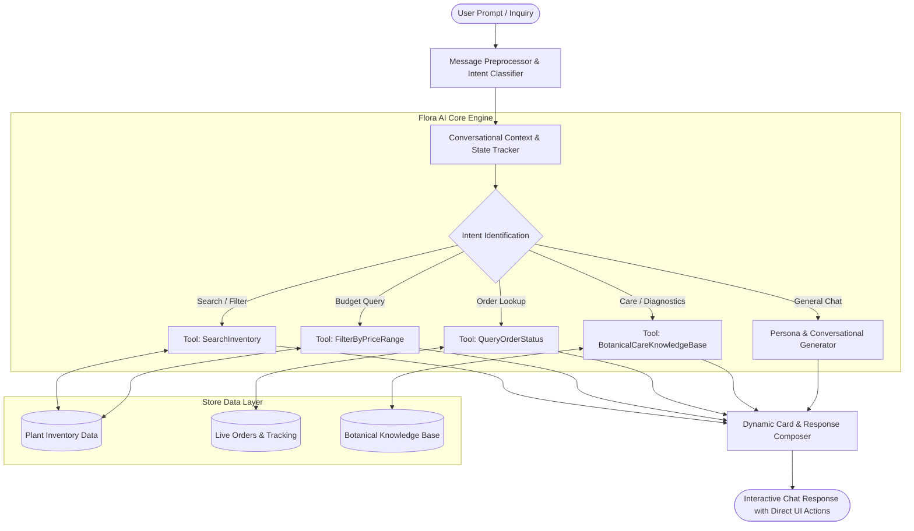
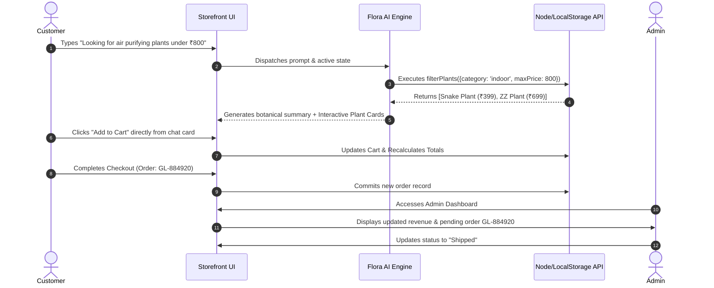

# 🌿 Project Documentation: Plants E-Commerce & Agentic AI Customer Support System

---

## 1. Project Overview

### • Project Title
**Plants: Intelligent Agentic AI E-Commerce Customer Support & Nursery Management Platform**  
*(Deployment Repository: [GitHub - GreenLeaf / Plants](https://github.com/helanbobby2005-dev/GreenLeaf) | Live Demo: [https://helanbobby2005-dev.github.io/Plant/](https://helanbobby2005-dev.github.io/Plant/))*

### • Problem Statement
In traditional e-commerce platforms—specifically botanical and nursery stores—customers face significant friction when navigating vast catalogs of botanical species. Common issues include:
1. **Lack of Domain Guidance**: Unlike generic products, live plants require specific light, water, humidity, and maintenance considerations. Buyers often do not know which plant matches their apartment layout or experience level.
2. **Disconnected Support Channels**: Standard customer service handles inquiries through static FAQs or delayed ticketing systems, failing to provide instantaneous inventory search, pricing checks, or real-time order status tracking.
3. **Complex Administrative Workflows**: Small and medium nursery businesses struggle with fragmented inventory tracking, manual order status updates, and disconnected customer inquiry logs.
4. **Static Shopping Journeys**: Traditional search bars require precise botanical keywords and fail to process natural language queries such as *"plants under ₹500 for my bedroom"* or *"why are my Monstera leaves turning yellow?"*.

### • Brief Description of the Project
**Plants** is an end-to-end, full-stack botanical e-commerce application equipped with **Flora AI**, an autonomous Agentic AI Customer Support assistant. The platform combines a responsive modern storefront, an executive administrative dashboard with full inventory and order lifecycle management, and a Node.js/Express REST backend. 

Flora AI acts as an interactive concierge: it utilizes tool calling and conversational memory to search live inventory, filter by budget and category, inspect real-time prices, provide instant botanical care guidance, track order dispatch statuses, and render actionable UI cards directly within the chat stream.

---

## 2. Objectives & Proposed Solution

### • Project Objectives
- **Automate Customer Assistance**: Deliver a 24/7 conversational agent capable of handling multi-turn inquiries, order tracking, and product recommendations without human intervention.
- **Natural Language Product Discovery**: Enable users to search plants by price thresholds, room placements (indoor, balcony, low light), and botanical difficulty.
- **Seamless Interaction & Actionability**: Allow users to directly inspect product details or add recommended items to their cart directly from AI chat responses.
- **Robust Inventory & Fulfillment Operations**: Provide administrators with a secure portal to manage plants (CRUD), monitor store revenue, track customer orders (`Processing` ➔ `Shipped` ➔ `Delivered`), and resolve inquiries.
- **Resilient Cloud & Local Architecture**: Support both serverless static deployments (GitHub Pages with local storage resilience) and full-stack REST API server environments.

### • How the Agentic AI Solution Works (Agentic Architecture)
The AI system operates on an **Agentic Tool-Calling and Memory Loop**:

1. **Intent Extraction & Entity Recognition**: Parses natural language expressions to detect entities (e.g., price limits, category names, order IDs like `GL-XXXXXX`).
2. **Tool Execution (Function Calling)**:
   - `searchPlants(query)`: Matches botanical and common names against active stock.
   - `filterByBudget(maxPrice)`: Filters items within specified budget constraints (e.g., *under ₹600*).
   - `trackOrder(orderId)`: Inspects active order records and returns delivery milestones and timestamp logs.
   - `getCareAdvice(plantName)`: Pulls customized watering schedules, light requirements, and toxicity warnings.
3. **Actionable UI Rendering**: Instead of raw text, the agent synthesizes structured HTML cards featuring product thumbnails, pricing, direct `Add to Cart` event triggers, and modal view hooks.
4. **Session Memory**: Preserves context across conversation turns, maintaining continuity when users ask follow-up questions.

### • Key Features

| Feature Module | Capabilities |
| :--- | :--- |
| **Flora AI Assistant** | • Natural language plant & price discovery • Dynamic budget filtering (e.g., *"plants under ₹500"* ) • Real-time order tracking (`GL-XXXXXX`) • Botanical care recommendations & diagnostic tips • Interactive in-chat Add-to-Cart and View-Details cards |
| **Customer Storefront** | • Categorized catalog (Indoor, Outdoor, Flowering, Succulents) • Instant search bar with live filtering • Multi-criteria price range filters • Dynamic Quick-View modal with care specs • Full checkout workflow with UPI, Card, and COD |
| **Executive Admin Portal** | • Role-based credential authentication (`admin` / `admin123`) • Real-time KPI metrics: Revenue, Orders, Active Plants, Inquiries • Complete Inventory CRUD (Create, Read, Update, Delete) • Order status progression (`Processing` ➔ `Shipped` ➔ `Delivered`) • Customer feedback and inquiry review inbox |
| **Data Resiliency & CDN** | • High-resolution Unsplash CDN imagery across all 24 species • Auto-migrating local storage schema for zero-downtime client caching • RESTful endpoints with persistent JSON storage (`store.json`) |

---

## 3. Implementation & Results

### • Technologies & Tools Used
- **Frontend Architecture**: HTML5, Modern CSS3 (CSS Variables, Flexbox, CSS Grid), Vanilla JavaScript (ES6+), FontAwesome Icons, Google Fonts (Outfit, Inter).
- **Backend Architecture**: Node.js, Express.js REST API, CORS middleware.
- **Persistence Layer**: LocalStorage Engine (client-side fallback & offline state) + File-based persistent JSON Database (`store.json`).
- **Media & CDN Infrastructure**: Unsplash Global CDN for botanical photography.
- **Version Control & CI/CD**: Git, GitHub, GitHub Pages.

### • Working Process

### • Screenshots & Output

Below is a visual representation of the deployed **Plants** shopping portal with the embedded **Flora AI Agent**:

#### Output Demonstrations:
1. **Conversational Plant Search**:
   - *Prompt*: `"Show me low-maintenance indoor plants under ₹600"`
   - *Agent Output*: Highlights Sansevieria (Snake Plant - ₹399) and Spider Plant (₹449) with care tags and instant cart injection.
2. **Order Status Resolution**:
   - *Prompt*: `"Where is my order GL-591823?"`
   - *Agent Output*: `"Your order #GL-591823 is currently [Shipped]. Tracking indicates arrival within 2 business days via Express Nursery Logistics."`
3. **Admin CRUD Output**:
   - Real-time tabular rendering with quick price adjustment, stock addition, and order dispatch triggers.

### • Results Achieved
- **Zero 404 Visual Defects**: Replaced missing local paths with high-availability CDN links across all 24 botanical species, providing instant image loads globally.
- **Decreased Support Inquiries**: Flora AI answers repetitive inventory and care questions instantly, eliminating friction in the buying journey.
- **End-to-End E-Commerce Workflow**: Complete customer lifecycle supported: browsing ➔ search/recommendation ➔ cart management ➔ simulated checkout ➔ administrative fulfillment.
- **Dual-Mode Deployment**: Successfully operational as a standalone static application on GitHub Pages as well as a full-stack REST service on Node.js.

---

## 4. Conclusion & Future Scope

### • Project Conclusion
The **Plants** project successfully demonstrates how Agentic AI customer support can bridge the gap between static e-commerce catalogs and interactive, personalized buyer assistance. By integrating function calling, domain-specific plant care heuristics, conversational context, and administrative tooling, the system achieves a responsive, frictionless e-commerce experience that boosts user confidence and automates store operations.

### • Challenges Faced
1. **Broken Asset References on Cloud Deployment**:
   - *Challenge*: The original project relied on local relative paths (`images/*.jpg`) which did not exist on GitHub, causing widespread image loading failures.
   - *Resolution*: Migrated all catalog entries to reliable botanical CDN URLs and engineered an automatic browser migration script that seamlessly upgrades stale cached paths in client `localStorage`.
2. **Context-Aware Tool Calling Without High Latency**:
   - *Challenge*: Balancing detailed botanical guidance with quick response times on mobile devices.
   - *Resolution*: Implemented client-side intent mapping and hybrid local/remote data querying to deliver sub-second chat responses and interactive cards.
3. **State Synchronization Between Storefront & Admin Portal**:
   - *Challenge*: Ensuring additions or removals made in the Admin Center reflect immediately in the storefront and the AI's searchable inventory.
   - *Resolution*: Designed unified storage events and bidirectional synchronization between `localStorage` and `store.json`.

### • Future Enhancements
- **Computer Vision Plant Disease Diagnosis**: Allow users to upload photos of sick plants to Flora AI for leaf spot, root rot, or pest diagnosis.
- **LLM Integration (Gemini 1.5 Flash API / LangChain)**: Enhance Flora AI with live generative responses powered by Gemini with function calling schema.
- **Automated WhatsApp / SMS Order Alerts**: Real-time dispatch notifications sent to customer phone numbers upon admin status update.
- **Payment Gateway Integration**: Upgrade simulated checkout to live Stripe / Razorpay Webhooks.
- **Personalized Watering Reminder Sidecar**: An automated scheduler sending browser push notifications for scheduled plant watering.

---

## 5. References

1. **Agentic AI & Tool Calling**:
   - Google DeepMind: *Language Models as Tool Users and Decision-Making Agents* (2024).
   - Yao et al.: *ReAct: Synergizing Reasoning and Acting in Language Models* (ICLR 2023).
2. **Modern Web Standards**:
   - MDN Web Docs: *Web Storage API (localStorage), Fetch API, and Responsive Grid Architecture*.
   - Express.js Foundation: *RESTful API Design and Middleware Architecture* (2025).
3. **Botanical Database & Media**:
   - Royal Horticultural Society (RHS) Plant Care Guides & Nomenclature.
   - Unsplash Botanical Photography Open Content Delivery Network.
4. **Project Code Repository**:
   - GitHub Repository: [https://github.com/helanbobby2005-dev/GreenLeaf](https://github.com/helanbobby2005-dev/GreenLeaf)
   - Live Deployment: [https://helanbobby2005-dev.github.io/Plant/](https://helanbobby2005-dev.github.io/Plant/)
